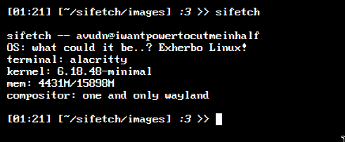

# sifetch

sifetch is a little fetch program written in C. I decided to use it to test my skills basically, and I'm going to update it whenever I have enough knowledge for it.

# Build

To build it, go to src/ directory and run: <br>
```bash
gcc -o sifetch main.c
```
Then, if you want to use it globally, just run: <br>
```bash
cp sifetch /usr/bin/sifetch
```

# Customization
For customization, you edit the ```config.h``` file.
# Preview

